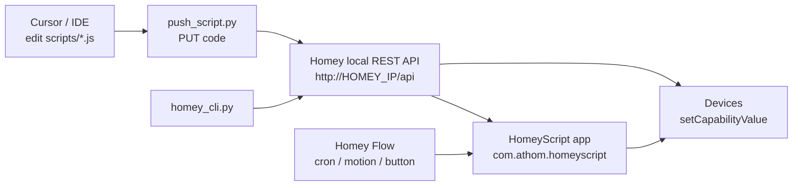

# Programming Homey from Cursor, Antigravity or any AI IDE

This guide shows how to control an [Athom Homey](https://homey.app) smart-home hub
from your computer using an IDE such as [Cursor](https://cursor.com), Antigravity or VS Code. You write automation logic as **HomeyScript** (JavaScript that runs on the
hub) and use a small Python toolkit to deploy and run it over Homey's local REST API.

---

## How it works

Automation logic lives as JavaScript on the Homey hub. You edit it locally, push it
over Homey's local REST API, and Homey Flows run it. Python can also command devices
directly without a script.



Two control paths:

- **HomeyScript (on-hub):** the main automation path. Scripts call
  `Homey.devices.getDevice()` and `setCapabilityValue()`. Triggered by Homey Flows.
- **Direct capability calls:** `homey_cli.py` can `PUT` a capability value
  (on/off, dim, etc.) straight to a device without any script.

---

## Prerequisites

- A **Homey Pro** (the models with a local API / local HomeyScript execution).
- The **HomeyScript** app installed on your Homey (from the Homey App Store).
- **Python 3.9+**. On Windows this project uses the miniconda install at
  `C:\ProgramData\miniconda3`.
- An IDE: **Cursor** is assumed here, but anything works.
- The `requests` Python package (see [requirements.txt](../requirements.txt)).
- Your computer must be on the **same local network** as the Homey.

---

## 1. Find your Homey's local IP

You need the hub's LAN IP for `HOMEY_IP`. Find it any of these ways:

- **Homey mobile app** -> Settings -> General (or Wi-Fi) -> note the IP address.
- **Your router**'s DHCP client/device list (look for a device named "Homey").
- **mDNS:** the hub is also reachable via its `.local` name on many networks.

Example used in this repo: `192.168.1.13`. If your Homey gets a new IP from DHCP,
update `HOMEY_IP`. Consider giving it a **static/reserved IP** in your router so it
never changes.

---

## 2. Get an API Key

1. Go to <https://my.homey.app>.
2. Open **Settings -> API Keys**.
3. Click **New API Key**, give it a name (e.g. `ide-dev`).
4. **Select the scopes** you need, then create and copy the key.

This key is used as a bearer token against the local API (see
[homey_control.py](../homey_control.py)):

```python
self.base_url = f"http://{ip}/api"
self.headers = {
    "Authorization": f"Bearer {api_key}",
    "Content-Type": "application/json",
}
```

### Scopes to enable

Pick scopes matching what you plan to do. For this toolkit (devices, scripts, flows,
variables, zones) enable:

| Scope | Why |
|-------|-----|
| `homey.device.readonly` | List/read devices and capabilities |
| `homey.device.control` | Turn on/off, dim, set capabilities |
| `homey.app` | Manage HomeyScript (`com.athom.homeyscript`) scripts |
| `homey.flow.readonly` | List/inspect Flows |
| `homey.flow.start` | Trigger Flows |
| `homey.logic` / `homey.logic.readonly` | Read/set Logic variables |
| `homey.zone.readonly` | Resolve zone names |
| `homey.insights.readonly` | Read Insights (optional) |

When in doubt, enable the readonly scopes plus `homey.device.control` and
`homey.app`; you can always create a new key with more scopes later.

---

## 3. Configure the project

Copy the template and fill in your values:

```bash
cp config.example.py config.py        # macOS / Linux
copy config.example.py config.py      # Windows (PowerShell/cmd)
```

`config.py` is **git-ignored**, so your secrets stay out of version control. Set:

```python
HOMEY_IP = "192.168.1.13"
HOMEY_API_KEY = "your-key-here"
```

Or leave `HOMEY_API_KEY = ""` and provide it via an environment variable. The
fallback is already wired up in [config.py](../config.py) /
[config.example.py](../config.example.py):

```python
import os
if not HOMEY_API_KEY:
    HOMEY_API_KEY = os.environ.get("HOMEY_API_KEY", "")
```

Set the env var:

```bash
# macOS / Linux
export HOMEY_API_KEY="your-key-here"

# Windows PowerShell
$env:HOMEY_API_KEY = "your-key-here"
```

---

## 4. Install dependencies

Using the conda install at `C:\ProgramData\miniconda3`:

```powershell
# Create and activate an environment (once)
C:\ProgramData\miniconda3\Scripts\conda.exe create -n homey python=3.11 -y
C:\ProgramData\miniconda3\Scripts\activate homey

# Install requirements
pip install -r requirements.txt
```

Or just run with the base interpreter directly:

```powershell
C:\ProgramData\miniconda3\python.exe -m pip install -r requirements.txt
```

On macOS/Linux a plain `python -m venv` works too:

```bash
python -m venv .venv && source .venv/bin/activate
pip install -r requirements.txt
```

---

## 5. Verify the connection

Run the controller's self-test (lists devices and scripts):

```bash
python homey_control.py
```

Or use the interactive CLI ([homey_cli.py](../homey_cli.py)):

```bash
python homey_cli.py
homey> devices
homey> scripts
```

If you see your devices listed, you're connected.

---

## 6. Core workflow

### Pull existing scripts from Homey

[sync_scripts.py](../sync_scripts.py) downloads every HomeyScript into `scripts/<name>.js`
and adds a header it needs for re-deploying:

```bash
python sync_scripts.py
```

Each file starts with:

```javascript
// Script ID: 70660ceb-6b2a-4919-ade3-02f19a619ebf
// Name: global-timer
```

### Edit in your IDE

Edit the JavaScript under `scripts/`. A typical device action:

```javascript
const device = await Homey.devices.getDevice({ id });
await device.setCapabilityValue({ capabilityId: "onoff", value: true });
```

### Deploy a script

[push_script.py](../push_script.py) reads the file, parses the `Script ID` from the
header, strips the header comments, and `PUT`s the code to Homey:

```bash
python push_script.py global-timer
```

### Run / test immediately

```bash
python homey_cli.py
homey> run <script_id>          # run a saved script
homey> code return 1 + 1;       # run ad-hoc JS
```

See [force_timer.py](../force_timer.py) for a scripted "clear state then run" pattern.

### Schedule or trigger via Flows

Automations are wired by Homey **Flows** whose action runs a HomeyScript. The action
card id is `homey:app:com.athom.homeyscript:run`. Examples that create such flows:
[create_timer_flow.py](../create_timer_flow.py) (a cron flow that runs every minute)
and [setup_blinds_flows.py](../setup_blinds_flows.py) (motion-triggered).

```python
"actions": [{
    "id": "homey:app:com.athom.homeyscript:run",
    "uri": "homey:app:com.athom.homeyscript",
    "args": {"script": {"id": SCRIPT_ID, "name": "global-timer"}},
    "group": "then",
}]
```

---

## 7. Using Cursor specifically

- **Open the folder** in Cursor (`File -> Open Folder`).
- Let the agent read and edit `scripts/*.js`; it understands the
  `getDevice` / `setCapabilityValue` patterns from the existing scripts.
- Use **Ask mode** to explore ("how does the timer decide sunset?") and
  **Plan mode** for larger changes before editing.
- Keep the **deploy step explicit**: after the agent edits a script, run
  `python push_script.py <name>` so you control exactly when code reaches the hub.
- Device IDs are long UUIDs - copy them from `homey_cli.py` `devices` /
  `find <name>` rather than guessing.

---

## 8. Security best practices

- **Never commit secrets.** `config.py` and `api.txt` are git-ignored by
  [.gitignore](../.gitignore). Use `config.example.py` as the shared template.
- **Prefer the `HOMEY_API_KEY` environment variable** for CI or shared machines.
- **Scope minimally:** create keys with only the scopes you need.
- **Rotate keys** if they were ever committed or shared (see warning below).
- The hub uses **HTTP on the LAN** (`http://HOMEY_IP/api`) - keep usage on a
  trusted network.

> **Important - rotate any previously committed secrets.** If this repo was ever
> pushed with secrets in `config.py` or `api.txt`, those values may live in git
> history. Regenerate/rotate them in the Homey web UI: the **API Key**, the
> **Personal Access Token**, the **API Client secret**, and any third-party keys
> (e.g. CallMeBot). Then stop tracking the files:
>
> ```bash
> git rm --cached config.py api.txt
> git commit -m "Stop tracking secrets; rotate keys"
> ```

---

## 9. Troubleshooting

| Symptom | Likely cause / fix |
|---------|--------------------|
| Times/sun calc are off by hours | HomeyScript runs in **UTC**. Get the hub timezone via `Homey.system.getInfo()` then format with `Intl.DateTimeFormat({ timeZone })`. Don't rely on `new Date().getHours()` for local time. |
| `401` / `403` from the API | Wrong/expired key, or the key lacks the required scope. Recreate with correct scopes. |
| Connection refused / timeout | Wrong `HOMEY_IP`, Homey on a different subnet/VLAN, or not on the same LAN. Verify the IP and reserve it in your router. |
| `No Script ID found in file header` | The `scripts/<name>.js` file is missing the `// Script ID:` header. Run `python sync_scripts.py` or add the header manually. |
| Script runs but device doesn't change | Check the capability name (`onoff`, `dim`, `windowcoverings_set`, ...) and that the device actually has it (`homey> device <id>`). |

---

## Reference: file map

| File | Purpose |
|------|---------|
| [homey_control.py](../homey_control.py) | `HomeyController` REST client (devices, scripts, flows, variables) |
| [homey_cli.py](../homey_cli.py) | Interactive CLI for devices/scripts/flows |
| [push_script.py](../push_script.py) | Deploy a local `scripts/<name>.js` to Homey |
| [sync_scripts.py](../sync_scripts.py) | Download scripts from Homey into `scripts/` |
| [config.example.py](../config.example.py) | Config template (copy to `config.py`) |
| `scripts/*.js` | HomeyScript automation source |
